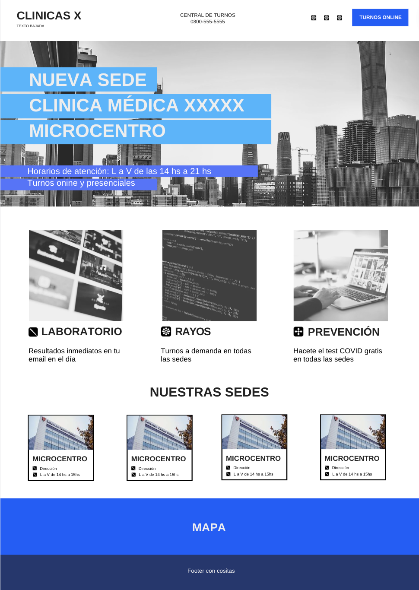

# Trabajo Práctico Integrador

## [Diplomatura en Desarrollo de Software WEB](https://www.cudi.ar/oferta-academica/area-diplomaturas/desarrollo-de-software/)

<!-- Front Matter -->
Integrantes: Daniela Colombo - Matias Riffo

Tutor: Mariano Mendez

---

<!-- Body -->
### Propuesta

1. Webapp para cadena de clínicas y centros médicos - El sitio web tendrá varias páginas: una pública, un área privada para los usuarios y otra administrativa para los centros médicos para brindar turnos, dar de alta usuarios, médicos, planes sociales, etc.

2. CRUD de doctores: nombre, foto, especialidad, horario de atención || CRUD de usuarios: datos personales, turnos, estudios.

3. Formulario de contacto / ingreso al portal de salud para los usuarios / pedido de turnos: fecha, centro médico, especialidad y horario.

### Inicializar el proyecto

Crear el archivo .env y agregar:

```console
MONGO_URI = "mongodb+srv://mongoUser:example.mongodb.net/?retryWrites=true&w=majority"
```

Abrir terminal en la raíz del directorio y ejecutar:

```console
> python3 -m venv cudi
> source ./cudi/bin/activate
> pip install -r requirements.txt
# flask run (usualmente usaríamos éste comando pero para usar hot reload y con F5 ver los cambios, ejecutamos...)
> python3 run.py
```

También se puede acceder desde [aquí](https://cudi-clinicamedica.onrender.com/)

### Posible error || Import "dotenv" could not be resolved (reportMissingImports)

```console
> pip install python-dotenv
> deactivate
> source ./cudi/bin/activate
```

### Boceto


