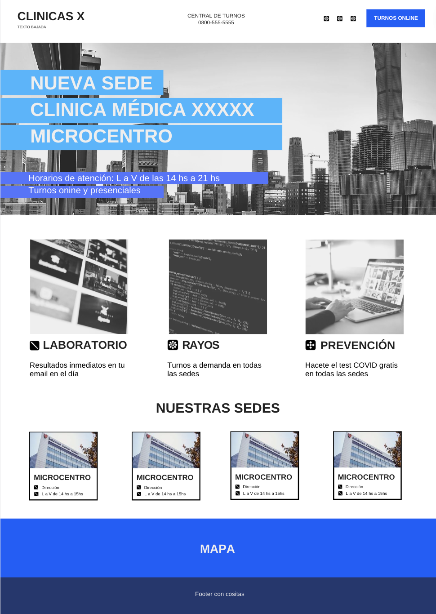

# Trabajo Práctico Final - Integrador

## [Diplomatura en Desarrollo de Software WEB](https://www.cudi.ar/oferta-academica/area-diplomaturas/desarrollo-de-software/)

<!-- Front Matter -->
Integrantes: Daniela - Matias

Tutor: Mariano Mendez

---

<!-- Body -->
### Guía propuesta por el corrector:

1. Web con lo estatico (Footer, header, navbar, Frames(google maps)) / Frontend - El sitio web tendrá 2 páginas, la visible y la administrativa (unidas ambas en la propia interacción).

2. ABM (CRUD) de doctores: nombre, foto, especialidad, horario de atención. ABM (CRUD) de usuarios: datos personales, turnos, estudios.

3. Armar en el sitio web un html que sea Staff y muestre todos los doctores.

4. Formulario de contacto / registración de usuarios / pedido de turnos: doctor y horario.

### Datos fake

Abrir terminal en la raíz del directorio y ejecutar:

> ~~python3 -m http.server
> flask run

### Boceto

